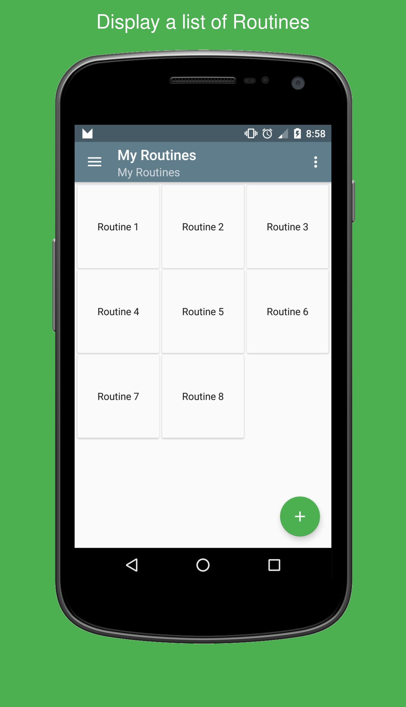

Gradle Frame Android screenshots Plugin
=========================================

[](https://github.com/chemouna/frame-gradle-plugin/blob/master/LICENSE.txt)
[](https://travis-ci.org/chemouna/frame-gradle-plugin)

###### Automate putting your screenshots quickly into Android device frames with their titles.

Usage
----

- install image imageMagick

```sh
brew install imagemagick
```

- Add the following to your build.gradle
   (use the new plugin syntax for gradle `2.1+`)

   ```groovy
   buildscript {
      repositories {
         maven {
           url "https://plugins.gradle.org/m2/"
         }
      }
   }

   plugins {
     id "com.mounacheikhna.screenshots.frame" version "0.1.6"
   }
   ```
- Usage: In your app build.gradle file :
 
   ```groovy
   frames {
       inputDir = "screenshots"
       outputDir = "output"
       framesDir = "frames"
       selectedFrame = "galaxy_nexus_port_back.png"
       localTitlesMap =  [
               "en_US": ["from": "Example screenshot title #1", "to": "Example screenshot title #2"],
               "fr_FR": ["from": "Exemple pour titre screenshot #1", "to": "Exemple pour titre screenshot #2"]
       ]
       backgroundColor = "#00cccc"
       textColor = "#FFFFFF"
       textSize = 40
       topOffset = 40
   }
   ```

Sample
------
See sample project for how to set, Sample result :




License
-------

    Copyright (C) 2016 Mouna Cheikhna

    Licensed under the Apache License, Version 2.0 (the "License");
    you may not use this file except in compliance with the License.
    You may obtain a copy of the License at

       http://www.apache.org/licenses/LICENSE-2.0

    Unless required by applicable law or agreed to in writing, software
    distributed under the License is distributed on an "AS IS" BASIS,
    WITHOUT WARRANTIES OR CONDITIONS OF ANY KIND, either express or implied.
    See the License for the specific language governing permissions and
    limitations under the License.
