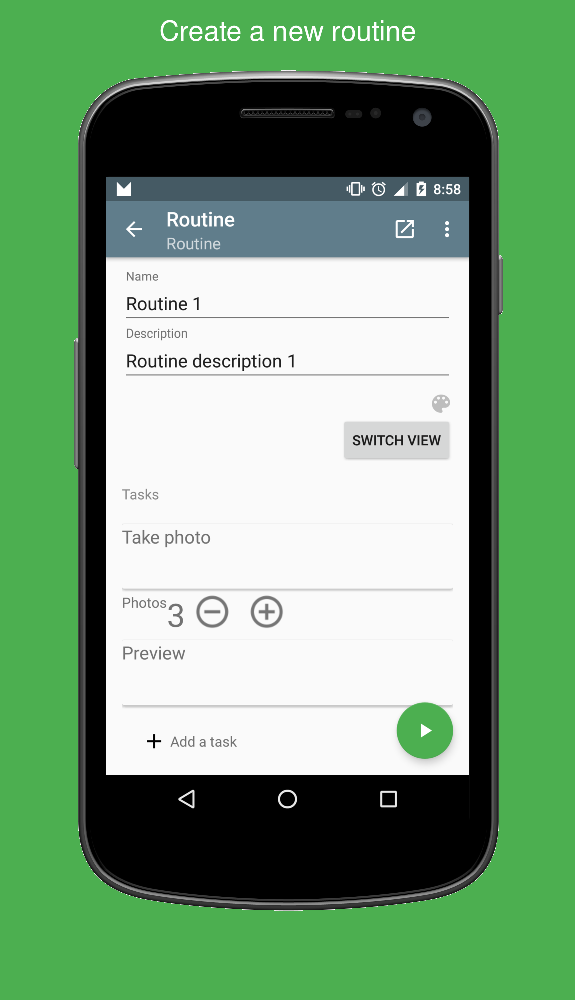
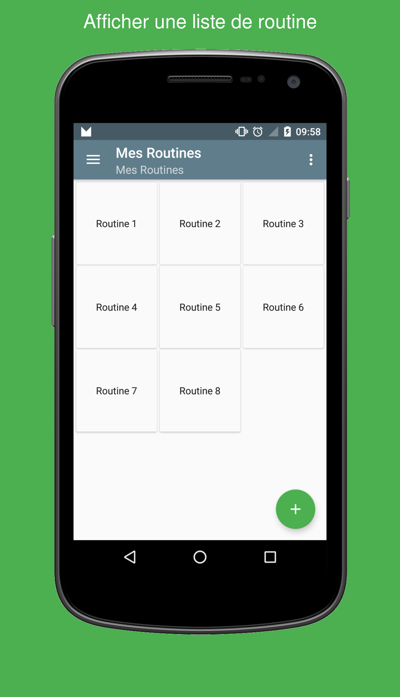
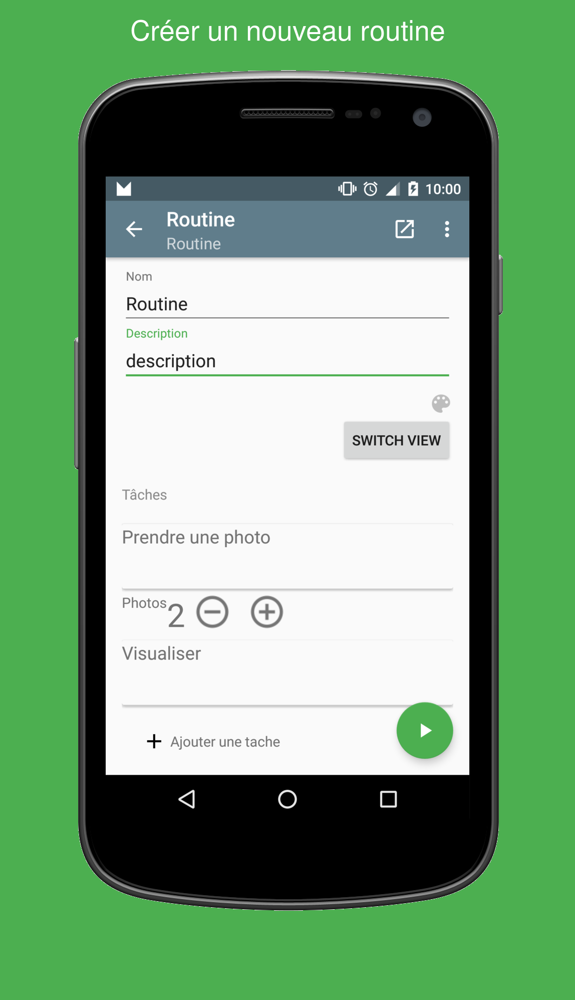
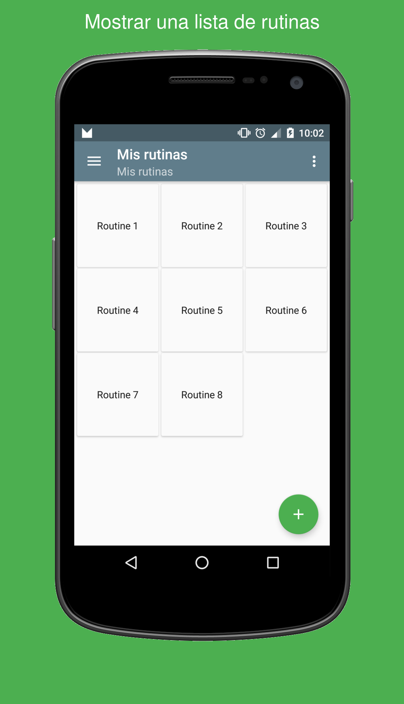
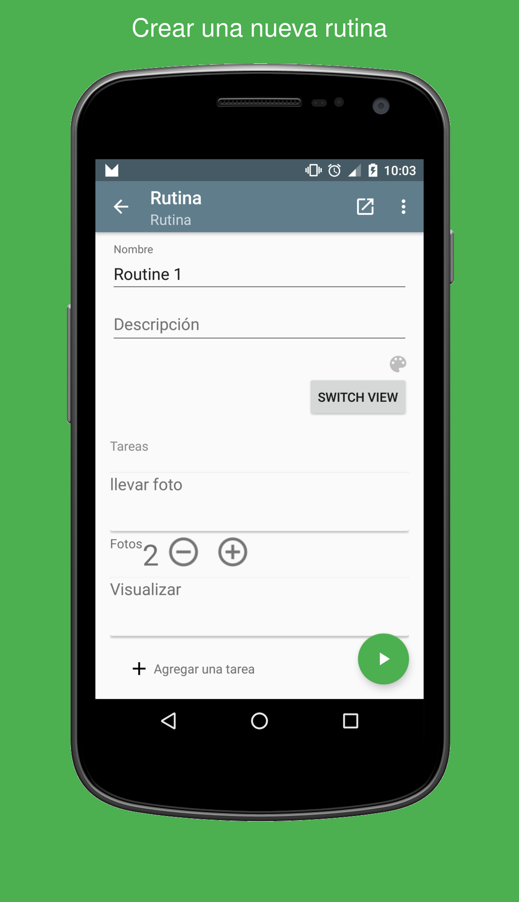

Gradle Frame Android screenshots Plugin
=========================================

[](https://github.com/chemouna/frame-gradle-plugin/blob/master/LICENSE.txt)

###### Automate putting your screenshots quickly into Android device frames with their titles.

Usage
----

- Install [ImageMagick](http://www.imagemagick.org/script/index.php) using Homebrew:

```sh
brew install imagemagick
```
and ghostscript for the text : 
```sh
brew install gs
```

- Add the following to your app's `build.gradle` file:
   (use the new plugin syntax for gradle `2.1+`)

   ```groovy
   buildscript {
      repositories {
         maven {
           url "https://plugins.gradle.org/m2/"
         }
      }
   }

   plugins {
     id "com.mounacheikhna.screenshots.frame" version "0.1.18"
   }
   ```
   
   or Add a maven dependency :
   ```maven
   <dependency>
     <groupId>com.mounacheikhna.screenshots</groupId>
     <artifactId>frame-gradle-plugin</artifactId>
     <version>0.1.18</version>
   </dependency>
   ```
   or Gradle < 2.1 dependency
   ```gradle
   buildscript {
       repositories {
           mavenCentral()
       }
   
       dependencies{
           classpath 'com.mounacheikhna.screenshots:frame-gradle-plugin:0.1.13'
       }
   }    
   ```
   
- Configure the plugin in your app's `build.gradle` file :
 
   ```groovy
   frames {
       inputDir = "screenshots"
       outputDir = "output"
       framesDir = "frames"
       selectedFrame = "galaxy_nexus_port_back.png"
       localTitlesMap =  [
               "en_US": ["from": "Example screenshot title #1", "to": "Example screenshot title #2"],
               "fr_FR": ["from": "Exemple pour titre screenshot #1", "to": "Exemple pour titre screenshot #2"]
       ]
       backgroundColor = "#00cccc"
       textColor = "#FFFFFF"
       textSize = 40
       topOffset = 40
   }
   ```

Sample
------
See sample project for how to set.

Here's a sample result for screenshots for my app Alias : 

    

    

    


Contributing
============

* [Check for open issues](https://github.com/chemouna/frame-gradle-plugin/issues) or open
   a fresh issue to start a discussion around a feature idea or a bug.
* Fork the [repository on Github](https://github.com/chemouna/frame-gradle-plugin)
   to start making your changes.
* Send a pull request and bug the maintainer until it gets merged and published.
   :) Make sure to add yourself to ``CONTRIBUTORS.txt``.
   
License
-------

    Copyright (C) 2016 Mouna Cheikhna

    Licensed under the Apache License, Version 2.0 (the "License");
    you may not use this file except in compliance with the License.
    You may obtain a copy of the License at

       http://www.apache.org/licenses/LICENSE-2.0

    Unless required by applicable law or agreed to in writing, software
    distributed under the License is distributed on an "AS IS" BASIS,
    WITHOUT WARRANTIES OR CONDITIONS OF ANY KIND, either express or implied.
    See the License for the specific language governing permissions and
    limitations under the License.

